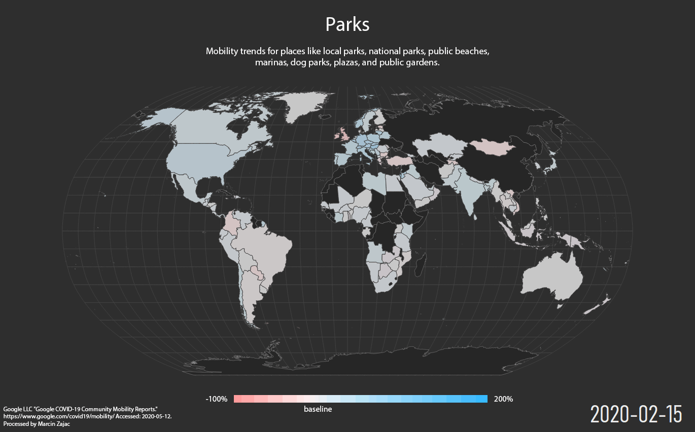

# 
Google COVID-19 Community Mobility Reports - Animated maps created in QGIS

### About data

These datasets show how visits and length of stay at different places change compared to a baseline. We calculate these changes using the same kind of aggregated and anonymized data used to show popular times for places in Google Maps.

Changes for each day are compared to a baseline value for that day of the week:

- The baseline is the median value, for the corresponding day of the week, during the 5-week period Jan 3–Feb 6, 2020.

- The datasets show trends over several months with the most recent data representing approximately 2-3 days ago—this is how long it takes to produce the datasets.
What data is included in the calculation depends on user settings, connectivity, and whether it meets our privacy threshold. If the privacy threshold isn’t met (when somewhere isn’t busy enough to ensure anonymity) we don’t show a change for the day. As a result, you may encounter empty fields for certain places and dates.

We include categories that are useful to social distancing efforts as well as access to essential services.

We calculate these insights based on data from users who have opted-in to Location History for their Google Account, so the data represents a sample of our users. As with all samples, this may or may not represent the exact behavior of a wider population.

## More:
[data documentation](https://www.google.com/covid19/mobility/data_documentation.html?hl=en)

<!--
Police legend             |  Spectral legend
:-------------------------:|:-------------------------:
|
|
|
|
|
|
-->

### Source

Google LLC "Google COVID-19 Community Mobility Reports".
[https://www.google.com/covid19/mobility/](https://www.google.com/covid19/mobility/) Accessed: 2020-05-12
